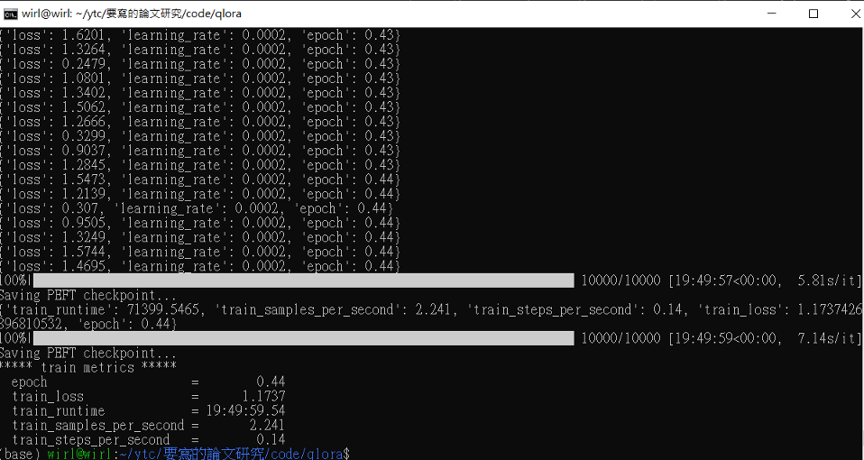

# master_thesis
題目: 基於輕量化微調大型語言模型的兩階段簡繁轉換框架

Thesis: Two-Stage Simplified to Traditional Chinese Conversion Framework Based on Parameter-Efficient Fine-Tuning of Large Language Models

## 摘要
本研究提出了一個兩階段的簡體轉繁體中文的字對字轉換架構，包含了輕量化微調大型語言模型以及非對稱映射機制，旨在提高資源受限的單機環境下的簡繁轉換正確性。在現有的方法中，有以統計式機器學習模型輔以斷詞的方式，也有先用各種方式抽取文字特徵後再以對數線性模型預測的方式，統計式機器學習模型需要極大量的語料且由於要從頭訓練所以訓練時間較久，而對數線性模型的做法則因為不是傳統自然語言處理會使用的方法所以較不直覺。因此本篇論文透過量化低秩適應附加器技術分別對簡體中文和繁體中文的大型語言模型進行指令微調。但是我們發現直接使用大型語言模型輸出的結果可能存在輸入與輸出不一致的「幻覺」問題。因此我們提出了一種能夠有效利用簡繁字之間的關係來做非對稱映射的機制，以便自動糾正這種幻覺現象。

我們利用公開的《教育部重編國語辭典修訂本》資料，依照 Alpaca 格式進行資料清洗，建立了擁有5個子任務及36萬筆指令的繁體中文指令資料集MOE-RMCD。實驗結果表明，簡繁轉換確實有其專業性，通用的語言模型難以泛化。本研究提出的非對稱映射機制對於未微調的大型語言模型進行零樣本的簡繁轉換任務具有非常顯著的幫助，最多能夠直接提升約80% 的簡繁字對轉換的 BLEU 與 GLEU 分數。此外，無論是未微調的或是微調後的大型語言模型，在自然語言的理解上都優於抽取文字特徵後再以對數線性模型預測的方式約 10% 至11%。這顯示了我們所提框架的有效性。

## Abstract
This study proposes a two-stage character-level conversion framework from Simplified Chinese to Traditional Chinese, incorporating lightweight fine-tuning of large language models and an asymmetric mapping mechanism. The aim is to enhance the conversion accuracy in resource-constrained standalone environments. Existing methods either rely on statistical machine learning models combined with word segmentation or extract textual features using various techniques before applying logistic regression models. Statistical machine learning models require a substantial amount of corpora and lengthy training times due to training from scratch, whereas logistic regression models are less intuitive as they are not traditional methods in natural language processing.

In this paper, we employ quantized low-rank adaptation （LoRA） techniques to fine-tune large language models for both Simplified and Traditional Chinese. However, we observed that the direct output from large language models might suffer from the "illusion" problem, where the input and output are inconsistent. To address this issue, we propose an asymmetric mapping mechanism that effectively leverages the relationship between Simplified and Traditional characters to automatically correct these inconsistencies.

We utilized the publicly available data from the "Revised Mandarin Chinese Dictionary" by the Ministry of Education, cleaned the data following the Alpaca format, and established a Traditional Chinese instruction dataset MOE-RMCD with five sub-tasks and 360,000 instructions. Experimental results indicate that Simplified-to-Traditional Chinese conversion indeed requires specialized handling, and general-purpose language models struggle to generalize effectively. Moreover, the proposed asymmetric mapping mechanism significantly aids zero-shot Simplified-to-Traditional Chinese conversion tasks for un-tuned large language models, improving the BLEU and GLEU scores of character conversion by up to 80%.

Additionally, whether using un-tuned or fine-tuned large language models, our approach outperforms the method of extracting textual features followed by logistic regression prediction in natural language understanding by approximately 10% to 11%.

## 程式碼 (code)
### ipynb
通常長的像這樣 
* `{階段}.{num}_{做的事}.ipynb`

## 使用資料集
- 訓練資料集: [MOE-RMCD](https://huggingface.co/datasets/ytchen175/MOE-RMCD)
    * 為本論文產出，詳細處理過程請參閱 `instruction_datasets/ministry_of_education_revised_dictionary.csv`

- 測試資料集: [COCT-twp-300k](https://huggingface.co/datasets/zetavg/coct-en-zh-tw-translations-twp-300k)

#### 階段 
* 1 代表準備資料集
* 2 代表用模型 inference ( 純測試僅供參考用 )

#### 比較重要的 notebook
* 1.3: 預處理 <教育部重編國語辭典修訂本> 讓他成為 instruction dataset，大量 cleansing 邏輯
    * 路徑為 `instruction_datasets/ministry_of_education_revised_dictionary.csv`
    * 在論文中命名為 **MOE-RMCD**
* 1.5: 將資料轉成 alpaca 格式以利餵入 qlora script
    * 路徑為 `instruction_datasets/alpaca-like_ministry_of_education_revised_dictionary.csv`
* 其他文本也有稍微整理但沒用在論文內 

#### 其他
* asymmetric_mapping_example: 非對稱映射機制的 example
* view_the_sample_of_diff_situations: 看 baseline 與 model 的翻譯輸出

### Python script

通常長的像這樣 
* `use_bl_{Baseline 名稱}_and_{微調與否}_{模型簡稱}_to_get_revise_output.py`

### Baseline 名稱
* OpenCC: 沒啥好說
* Google Translate: 參考 `gtrans.py`
* XMUCC: Windows 限定，請從 [汉字简繁文本智能转换系统](https://jf.xmu.edu.cn/) 下載

### 微調與否
* Org: 代表使用**未微調**的 LLM 做為參考 (Reference)
* FTed: 代表使用**微調後**的 LLM 做為參考 (Reference)
    * 使用前請先跑過 QLoRA 並帶上 fine-tune step 的參數，例如 `--ft_num 1250`

### 模型縮寫
* CH_ALPACA = `Chinese-Alpaca`
* TWLLM = `Taiwan-LLM`
* TAIDE = `TAIDE`

### 其他說明
* 只要是後綴有 `get_revise_output` 就代表有用非對稱映射機制
* `非對稱映射機制` 具體而言就是 `revise_asymmetric_characters_by_llm` 這個 function

## 微調
### qlora
為了防止混亂，qlora 資料夾代表不同模型
* qlora = `Chinese-Alpaca`
* qlora2 = `Taiwan-LLM`
* qlora3 = `TAIDE`

output dir 裡面有 250 ~ 10000 steps 的結果

p.s. 可以再使用 `infer_exp_all.sh` 對指定語句進行全部的推論並使用表現看起來最好的 model

### 訓練
移動到跟模型相對應的目錄
```bash
cd {qlora, qlora2, qlora3}
```

使用 script，範例如下
```bash
python qlora.py \
--model_name_or_path "/home/wirl/ytc/TAIDE-LX-7B-Chat" \
--bits 4 \
--bf16 \
--dataset "alpaca" \
--max_memory_MB 12000
```



#### 為何要改 source code ?
若是直接以上面這段 script 跑 qlora repo 的 qlora.py 的話會出現 `NotImplementedError: Dataset ... Not implement yet`，

追根究柢應該是 `local_dataset` 沒用，所以選擇將 `qlora.py` 做了一些改寫，兩大改動如下：

一：不從 HuggingFace 上拉資料，直接讀 local 端的 csv 檔
```python
if dataset_name == 'alpaca':
    # return load_dataset("tatsu-lab/alpaca")
    return load_dataset("csv", data_files="...alpaca-like_ministry_of_education_revised_dictionary.csv")
```

二：load data 時處理欄位空值
```python
def format_dataset():
...
        if args.group_by_length:
            print("Loading data...")
            # train_dataset = train_dataset.map(lambda x: {'length': len(x['input']) + len(x['output'])})
            train_dataset = train_dataset.map(lambda x: {'length': len(x['input']) + len(x['output']) if (isinstance(x['output'], str) and x['output']) else 0})
            print("Data loaded.")
```

## 結果
請見 `compare_all_asy_mapping_results.ipynb`

## CUDA 與 CUDNN
* CUDA=12.1
* CUDNN=8.9.2

**Don't** install `nvidia-cuda-toolkit`, it will overwrite all set env.

## 注意事項
ipynb 跑 QLoRA 可能會 OOM，似乎是取決於 Transformers、TRL 等版本，建議使用 QLoRA 官方 script
